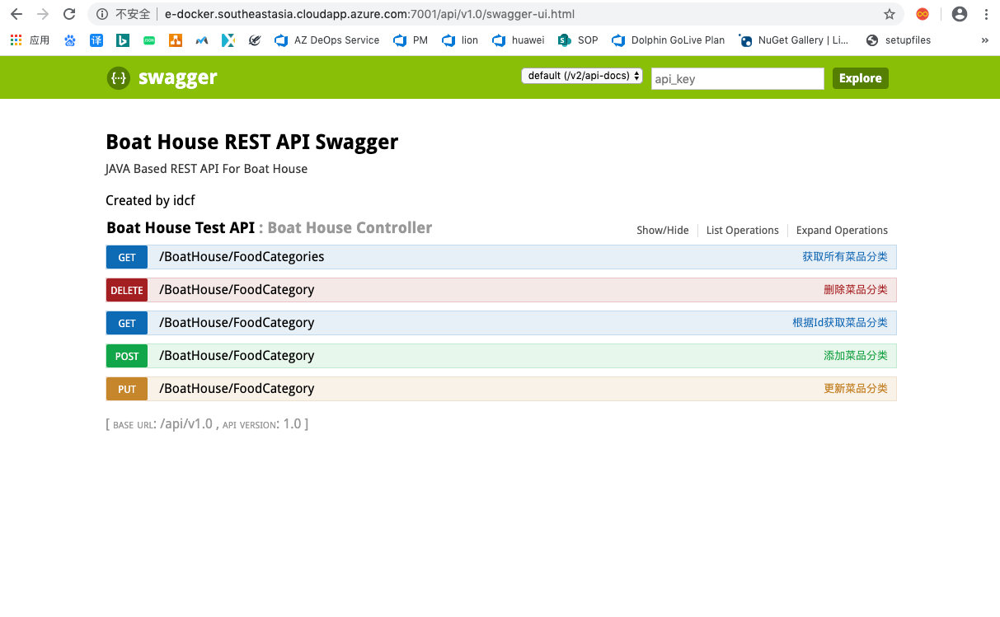

### Boat House开发环境部署


在前面的文档中，我们已经部署好Jenkins的流水线，接下来将部署Boat House的Dev环境。
我们将会在云资源的另外一台虚拟机 Docker VM 上部署团队自己的Dev环境：


#### 安装Docker

请使用ssh命令登录vm-dev，并参考如下命令安装Docker以及docker-compose

```
sudo apt-get update
sudo apt install docker.io
sudo usermod -a -G docker localadmin
sudo curl -L "https://github.com/docker/compose/releases/download/1.25.3/docker-compose-$(uname -s)-$(uname -m)" -o /usr/local/bin/docker-compose
sudo chmod +x /usr/local/bin/docker-compose
sudo systemctl daemon-reload
sudo systemctl restart docker 

sudo groupadd docker #添加docker用户组
sudo gpasswd -a $USER docker #将登陆用户加入到docker用户组中
newgrp docker #更新用户组
```

运行完以上命令重新登陆虚拟机,并执行以下命令，测试Docker是否安装成功
```
docker --version #docker
docker-compose --version #docker-compose
```


#### Jenkins添加Docker VM的连接密钥
1. 打开Jenkins流水线，进入凭据配置界面，点击添加凭证

1. 添加vm-dev的连接密钥
用户名密码为登陆vm-dev的用户名密码，ID需为‘creds-dev-server’。


#### Jenkins添加Docker Registry的连接密钥


用户名以及密码，ID需'creds-github-registry’。


#### 启动master分支构建
1. 点击master分支后面的构建button，启动构建

1. 构建过程中查看输出情况


#### 查看部署结果
Dev环境部署完毕，打开以下链接，查看部署结果：
1. Client Web 
http://{Docker VM Host}:5000

1. Management Web
http://{Docker VM Host}:5001

1. Product Service AP Swagger UI
http://{Docker VM Host}:7001/api/v1.0/swagger-ui.html


**注意：暂时没有提供k8s集群环境，所以大家暂时不要部署测试以及生产环境**
