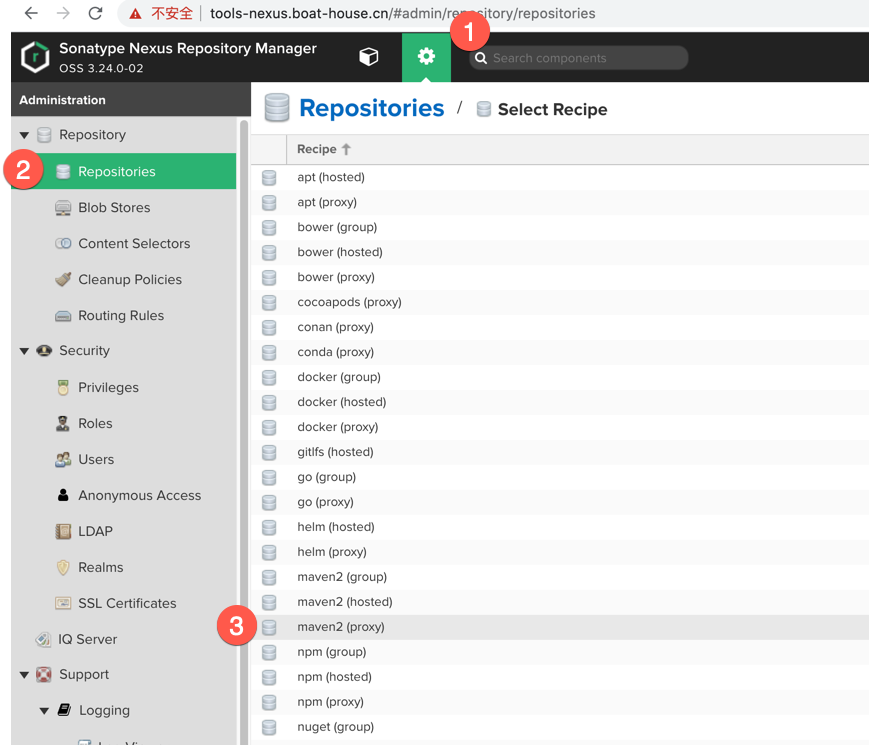
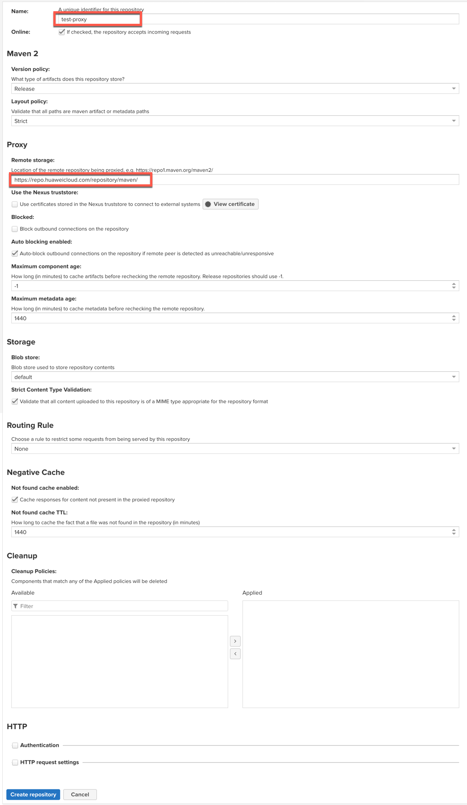
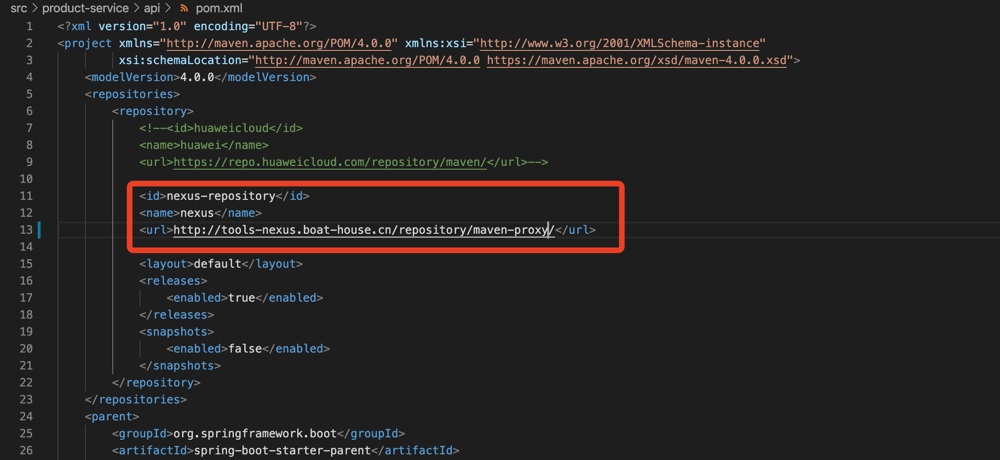
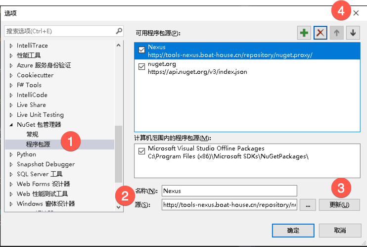

# Nexus搭建及使用指南

## 安装
``` Bash
# Docker 安装
sudo apt-get update
sudo apt install docker.io
sudo usermod -a -G docker {localadmin}

sudo curl -L "https://github.com/docker/compose/releases/download/1.25.3/docker-compose-$(uname -s)-$(uname -m)" -o /usr/local/bin/docker-compose
sudo chmod +x /usr/local/bin/docker-compose

sudo systemctl daemon-reload
sudo systemctl restart docker 

# Nexus 安装
sudo mkdir ~/nexus-data 
sudo chown -R 200 ~/nexus-data
docker run -d -p 8081:8081 -p:2020:2020 --name nexus -v ~/nexus-data:/nexus-data sonatype/nexus3

# 查看admin用户的默认密码
sudo cat ~/nexus-data/admin.password
``` 

## 仓库类型
具体仓库类型主要分为hosted/proxy/group三种。
+ proxy 是远程仓库的代理。比如说在nexus中配置了一个central repository的proxy，当用户向这个proxy请求一个artifact，这个proxy就会先在本地查找，如果找不到的话，就会从远程仓库下载，然后返回给用户，相当于起到一个中转的作用。
+ hosted 是宿主仓库，用户可以把自己的一些构件，deploy到hosted中，也可以手工上传构件到hosted里。比如说oracle的驱动程序，ojdbc6.jar，在central repository是获取不到的，就需要手工上传到hosted里。
+ group 是仓库组，在maven里没有这个概念，是nexus特有的。目的是将上述多个仓库聚合，对用户暴露统一的地址，这样用户就不需要在pom中配置多个地址，只要统一配置group的地址就可以了。

***一般使用Proxy类型就可以了！***


## Maven
选择 Server administration and configuration 
选择 Repository > Repositories
选择 Create Prepository
选择 maven2(proxy)

输入name
remote storage： https://repo.huaweicloud.com/repository/maven/
其他选项默认即可
点击按钮 Create Prepository ，保存


进入列表页
点击 Analyze 开启统计
点击 Copy 复制repository的地址


打开POM文件，修改
``` XML
<id>nexus-repository</id>
<name>nexus</name>
<url>http://tools-nexus.boat-house.cn/repository/maven-central/</url>
```



## NPM
选择 Server administration and configuration ，
选择 Repository > Repositories
选择 Create Prepository
选择 npm(proxy)
录入name、remote storage（建议使用 https://r.npm.taobao.org/）
进入列表页 点击 Analyze 开启统计
进入列表页 点击 copy 复制repository的地址
打开命令行工具，修改NPM的源地址
``` Bash
# mac 
cnpm config set registry http://tools-nexus.boat-house.cn/repository/npm-proxy/

# windows / linux
npm config set registry http://tools-nexus.boat-house.cn/repository/npm-proxy/
``` 


## NuGet
选择 Server administration and configuration ，
选择 Repository > Repositories
选择 Create Prepository
选择 nuget(proxy)
录入name、remote storage（建议使用 https://nuget.cnblogs.com/v3/）
进入列表页 点击 Analyze 开启统计
进入列表页 点击 copy 复制repository的地址

打开 Visual Studio
点击菜单项 工具，点击 选项
点击 NuGet包管理器，点击 程序包源， 点击“+”图标新建源， 输入名称、源地址，点击更新 ，点击“↑”把当前程序包源优先级提到最高，点击 确定 提交


