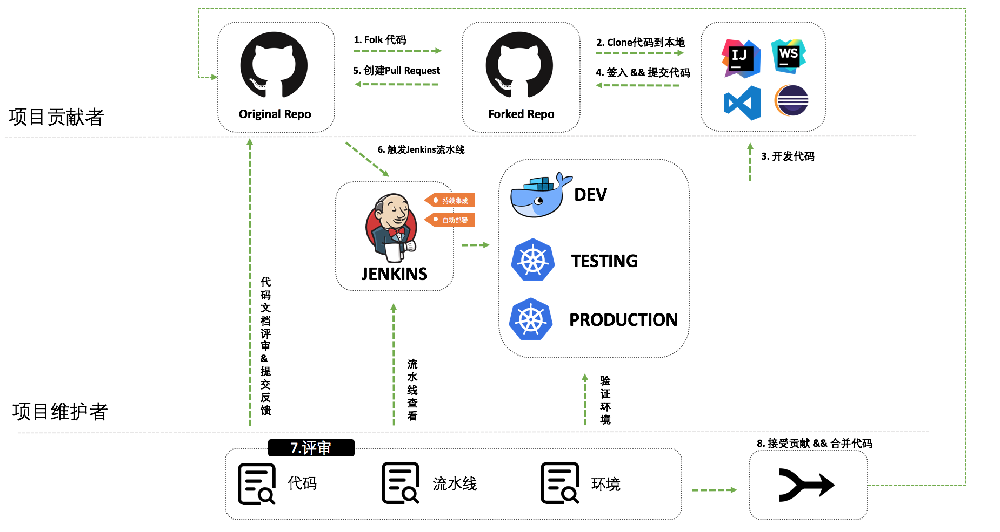
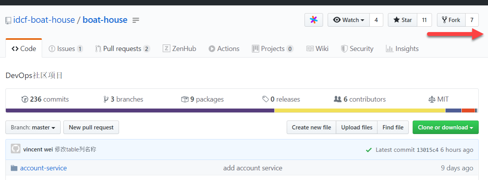
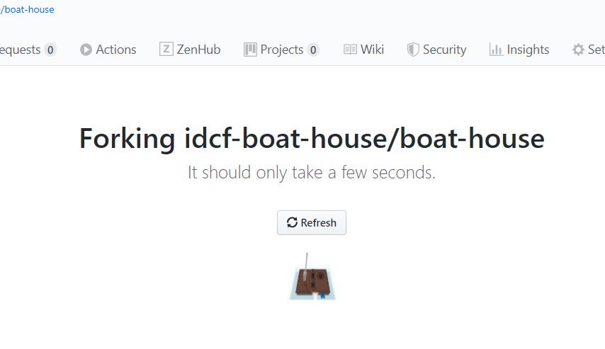
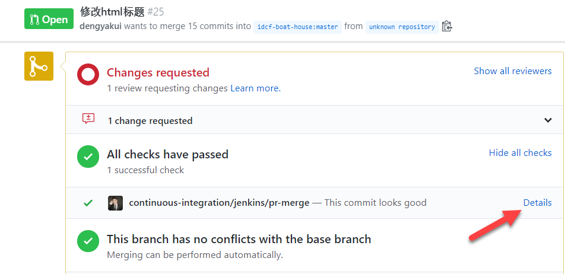
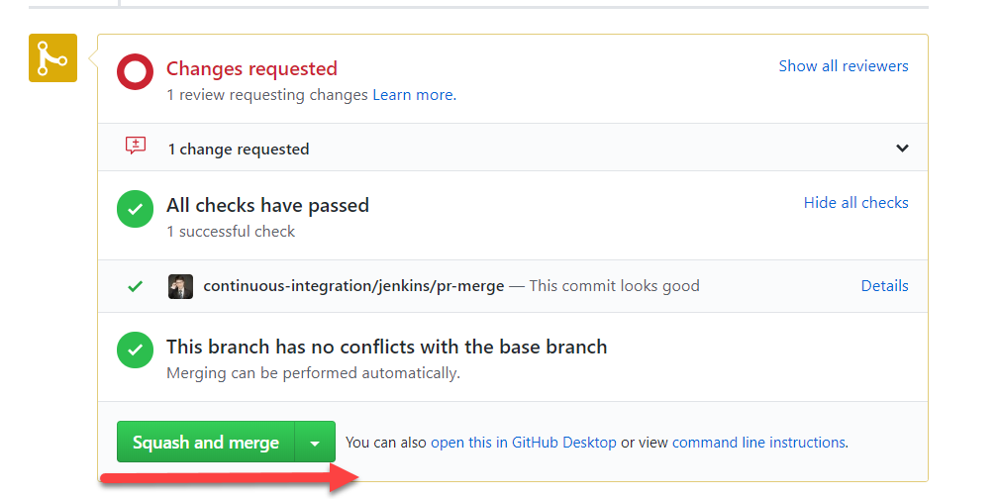

BoatHouse项目中主要有两种角色， 项目维护者和项目贡献者。项目贡献者可以参与到项目开发中，可以为项目增加新的feature，提出issue， 并使用PullRequest的方式将自己的成果贡献给社区。项目维护者主要对项目的PullReqest进行Review，讨论，以及文档、环境的编写维护。




## Folk 代码 - 项目贡献者

1. 进入仓库主页面，点击右上方的 **Fork** 按钮，将仓库 fork 到个人 github 仓库下<br />
2. 等待 fork 完成<br />

3. fork 完成后，自动转到 fork 后的个人仓库，使用命令行将仓库获取到本地
```bash
git clone https://github.com/<your github name>/boat-house.git
```

<a name="dTaSm"></a>
## 同步最新代码

方式一：命令行同步

每次更改代码之前，首先需要同步最新代码，将代码从主仓库合并到fork库中

```bash
git checkout master
git remote add upstream https://github.com/idcf-boat-house/boat-house.git
git fetch upstream
git merge upstream/master
```

方式二：工具同步

团队也可以采用工具的方式进行同步：

下载Github Desktop:https://desktop.github.com/


<a name="b7mmv"></a>
## 本地修改&提交 - 项目贡献者

1. 代码克隆到本地以后，使用vscode 代码打开
1. 打开仓库下的 **client/web/index.html** 文件
1. 定位到文件第4行，将本行内容替换为以下文字  <br />
```
<title>船屋餐厅 - 苏格兰风味、红酒炖羊腿、Cullen Skink、黄油饼干、燕麦硬饼</title>
```

4. 填写 git 提交信息为 "修改 html 标题文字"
4. 提交 master 分支，并同步到远程仓库

<a name="eOoKb"></a>

## 发起 PullRequest - 项目贡献者

1. 将修改的代码同步到github以后，进入Folk仓库的PullRequest页面，点击按钮创建新的PullRequest<br />
2. 选择仓库分支为master，然后提交<br />
<a name="OLZue"></a>

## 触发CI持续集成 - 项目贡献者 && 维护者

1. 提交PullRequest以后，系统会自动触发 Jenkins 持续集成，进行构建（可以匿名访问），点击details 链接，查看jenkins执行信息<br />

2. 等待dev环境部署完成后，打开dev站点，查看变更后的文字

<a name="StwrR"></a>
## 
<a name="upJ00"></a>

## 代码Review && 提出问题 - 项目维护者

提交PullRequest后，项目维护者会对PullRequest进行代码Review，并给出适当的建议<br />

<a name="HntfF"></a>

## 修复代码问题 - 项目贡献者

1. 项目贡献者根据讨论内容，在本地仓库中打开 client\web\src\components\Products.vue 文件，找到第14行，将内容替换为 **Great food, great people!<br />**
1. 将变更提交到master分支，并同步到github
1. 变更会触发一次新的持续集成，并观察dev环境的文字变化


## 环境部署 && 验证 - 项目维护者

1. 开发环境验证，打开开发环境网址查看系统运行是否正常，并进行简单测试。

2. 测试环境验证，流水线会停留在测试环境部署并等待审批，配置管理人员点击确定，完成测试环境的部署。并查看测试环境应用是否运行正常。

3. 部署生产之前使用以下命令实时查看Pod运行情况。

```bash
kubectl get pods -n <namespace> --watch
```

4. 生产环境验证，流水线会停留在生产环境部署并等待审批，配置管理人员点击确定，完成生产环境的部署。并查看生产环境应用是否运行正常。

<a name="Xrh9g"></a>
## 接受PullRequest && 合并代码 - 项目维护者
项目维护者选择接受PullRequest，点击合并按钮，将变更合并到仓库中。<br />


