### 登录虚拟机

使用ssh登录vm01
```
ssh localadmin@<ip>
```

### 1. Docker 安装

由于整个环境我们都使用容器的进行部署，所以需要在环境中先安装Docker以及docker-compose，执行以下shell命令安装。
```
sudo apt-get update
sudo apt install docker.io
sudo usermod -a -G docker localadmin
sudo curl -L "https://github.com/docker/compose/releases/download/1.25.3/docker-compose-$(uname -s)-$(uname -m)" -o /usr/local/bin/docker-compose
sudo chmod +x /usr/local/bin/docker-compose
sudo systemctl daemon-reload
sudo systemctl restart docker 

sudo groupadd docker #添加docker用户组
sudo gpasswd -a $USER docker #将登陆用户加入到docker用户组中
newgrp docker #更新用户组
```
运行完以上命令重新登陆虚拟机,并执行以下命令，测试Docker是否安装成功

```
# docker
docker --version

# docker-compose
docker-compose --version
```

### 2. 搭建Jenkins
使用以下命令完成Jenkins的安装

```
sudo mkdir ~/jenkins_home 
sudo chown -R 1000:1000 ~/jenkins_home
sudo docker run -d -p 8080:8080 -p 50000:50000 -v ~/jenkins_home:/var/jenkins_home -u 0 jenkins/jenkins:lts
docker ps
```


##### 获取管理员账号密码
``` 
sudo cat jenkins_home/secrets/initialAdminPassword
# 也可以通过日志查看密码
docker logs <jenkins containerID>
```

复制上面的输出结果

##### 启动Jenkins网站
在浏览器中打开jenkins站点，粘贴上面的管理员密码，并点击 **Continue** 按钮
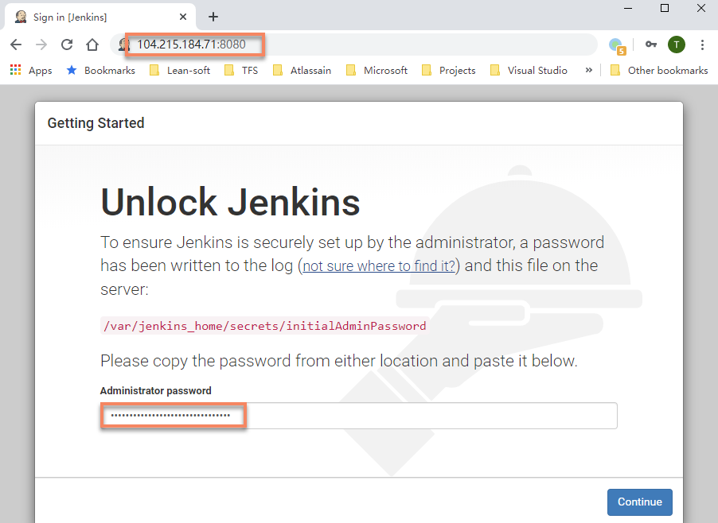

##### 选择安装建议插件
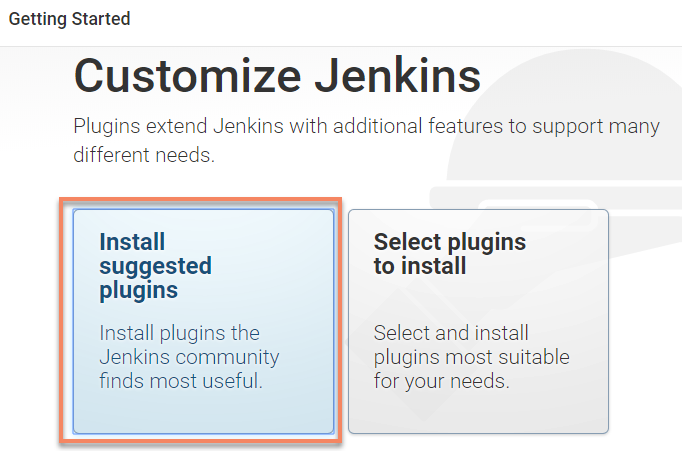

##### 初始化管理员账号密码，都填写为admin即可，然后点击 **Save and Continue**
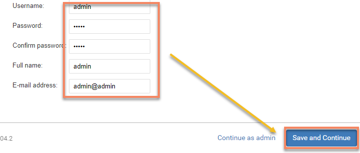

##### 保持默认的URL设置
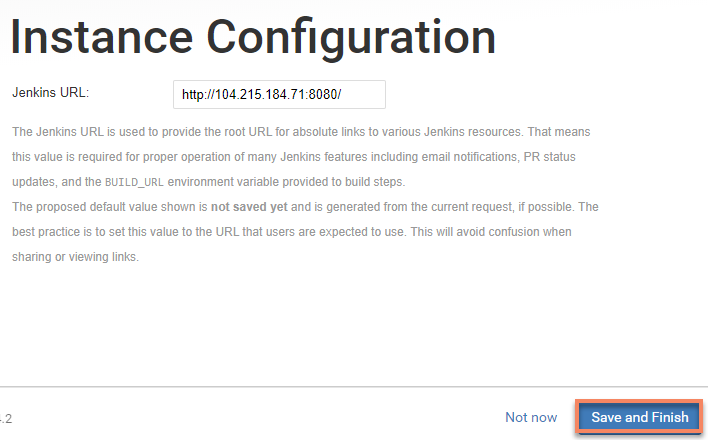

##### 完成服务器搭建，启动Jenkins
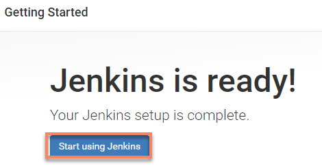

****

#### Jenkins 配置
Jenkins流水线中的各个任务的运行需要跑在一台代理机上，因此我们需要给Jenkins添加构建节点。
在本示例中将使用两台云资源虚拟机中的 Jenkins VM 作为代理机。


##### 代理机安装JDK
```
sudo apt-get update
sudo apt-get install openjdk-8-jdk
java -version
```
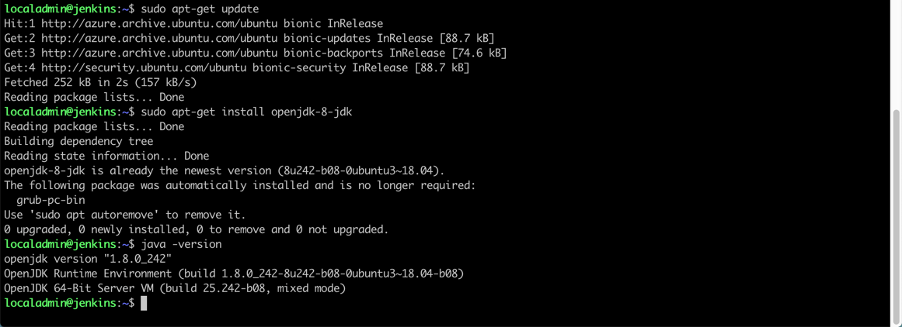

##### 代理机添加localadmin（当前登陆账号）至Sudoers
1. 添加localadmin至sudo组：
    ```
    sudo usermod -aG sudo localadmin
    ```
1. 添加localadmin至sudoers文件：
    ```    
    sudo vim /etc/sudoers
    # /etc/sudoers文件最末尾添加下面代码：localadmin ALL=(ALL) NOPASSWD:ALL
    ```

##### 代理机创建Jenkins工作目录, 并创建文件确保目录在非sudo下可写
  ```
  mkdir jenkins_workspace
  cd jenkins_workspace
  touch test
  ls
  ```


##### Jenkins添加构建节点
1. 在jenkins管理界面进行节点管理，**Manage Jenkins**
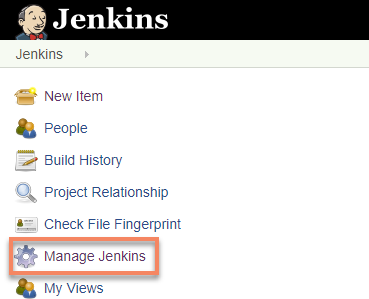

1. 点击 **Manage Nodes** 


1. 点击  ** New Node**


1. 按照下图输入代理名称并勾选**Permanent Agent**，然后点击 **OK**


1. 在创建节点界面输入参数:
    | 参数名 | 参数值 |
    |--|--|
    | # of executors | 1 |
    | Remote root directory	 | /home/localadmin/jenkins_workspace |
    | Labels | vm-slave (此处很关键，后面JenkinFile流水线文件中会根据此label选取代理机) |
    | Launch method | Launch agents via SSH |
    | Host | {代理机的Host} |
    | Host Key Verification Strategy | Non verifying Verification Strategy |

1. 创建链接到salve容器认证


1. 在认证编辑界面输入参数：
    | 参数名 | 参数值 |
    |--|--|
    | Username | {代理机Username} |
    | Password | {代理机Password} |
    | ID | d-slave |
    | Description | d-slave |

1. 然后点击 **Add**
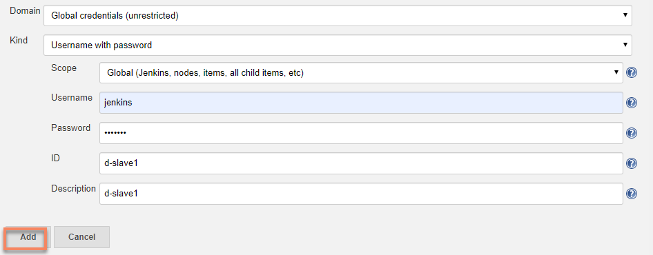

1. 返回节点编辑界面后，选择刚才新建的认证


1. 完成节点编辑，点击**Sava**
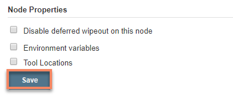

1. 回到列表页面后启动节点


1. 按照下图手动点击启动节点
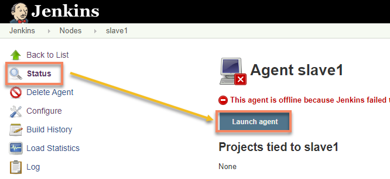

1. slave正常启动


1. 回到节点列表


1. 节点显示正常


##### Jenkins安装插件

1. 打开Jenkins控制面板首页，在左侧菜单中选择 **管理Jenkins** ，进入管理页面后，点击 **管理插件**，安装插件： Cobertura、Kubernetes Continuous Deploy、SSH Pipeline、Blue Ocean
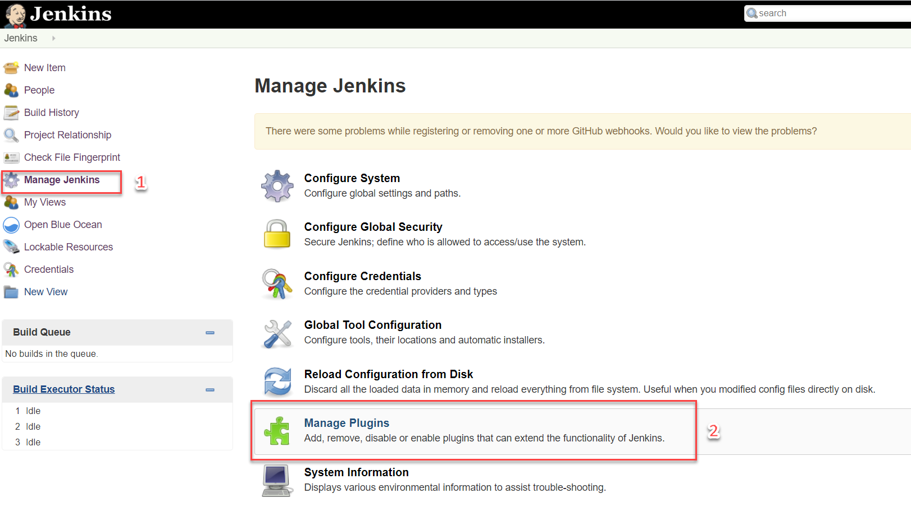
1. 进入插件页面， 选择项目的 **可用** tab，并在上面搜索框中输入 **cobertura** 找到cobertura插件，选择安装
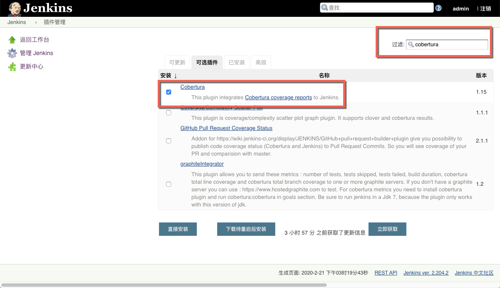
1. 进入插件页面， 选择项目的 **可用** tab，并在上面搜索框中输入 **Kubernetes Continuous Deploy** 找到k8s CD 插件，选择安装

1. 进入插件页面， 选择项目的 **可用** tab，并在上面搜索框中输入 **SSH Pipeline** 找到SSH Pipeline Steps插件，选择安装
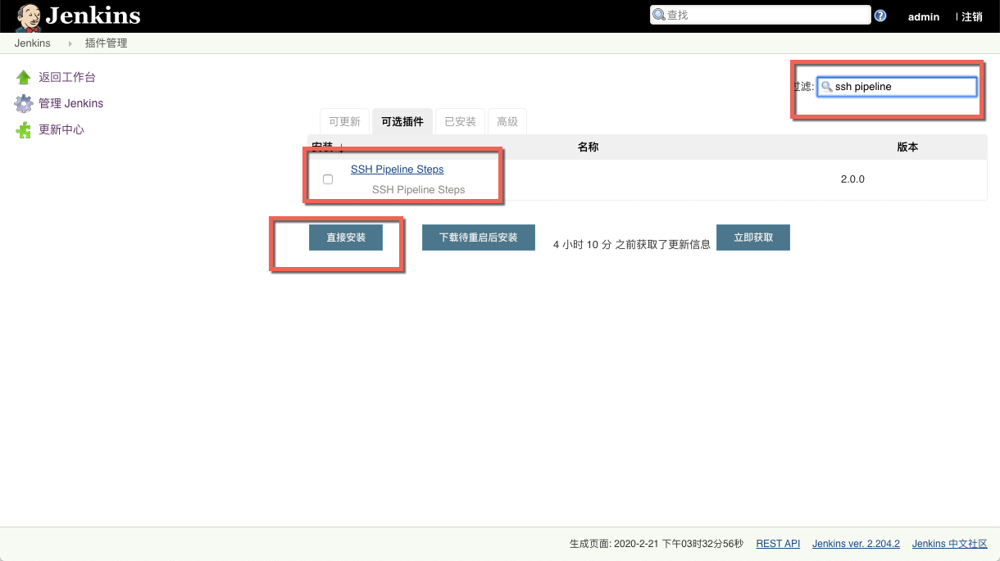
1. 进入插件页面， 选择项目的 **可用** tab，并在上面搜索框中输入 **Blue Ocean** 找到blueocean插件，选择安装
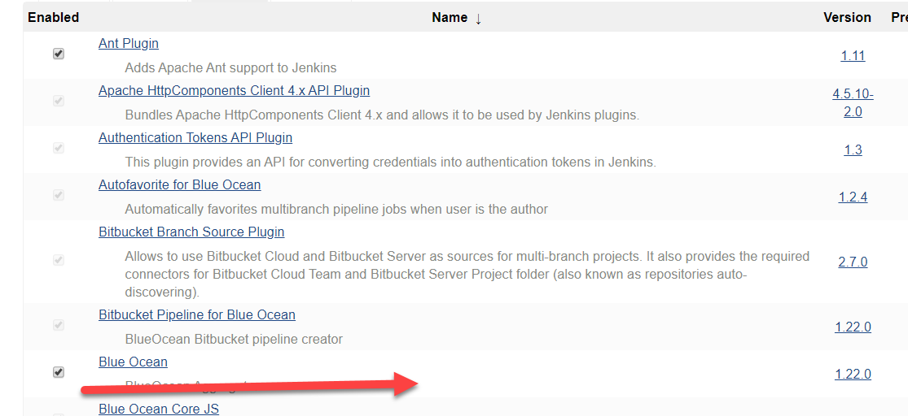

至此，团队环境中的Jenkins设置完毕。
****
### 3. 搭建Nexus
使用docker的方式来搭建Nexus，使用如下命令：
```
sudo mkdir ~/nexus-data 
sudo chown -R 200 ~/nexus-data
docker run -d -p 8081:8081 -p:2020:2020 --name nexus -v ~/nexus-data:/nexus-data sonatype/nexus3
```
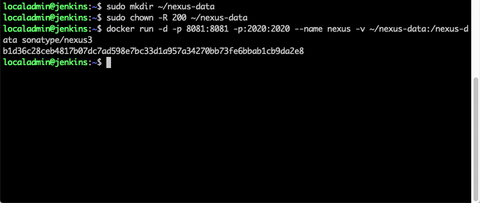
Nexus容器启动后，进入nexus-data文件夹查看admin.password文件中的初始密码

sudo cat ~/nexus-data/admin.password
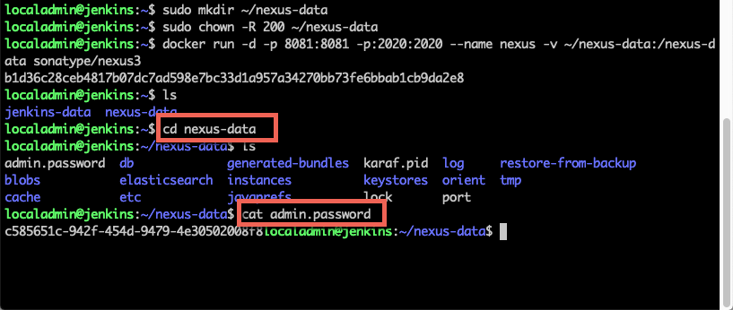
浏览器打开对应的8081端口，点击 Sign in 登陆：
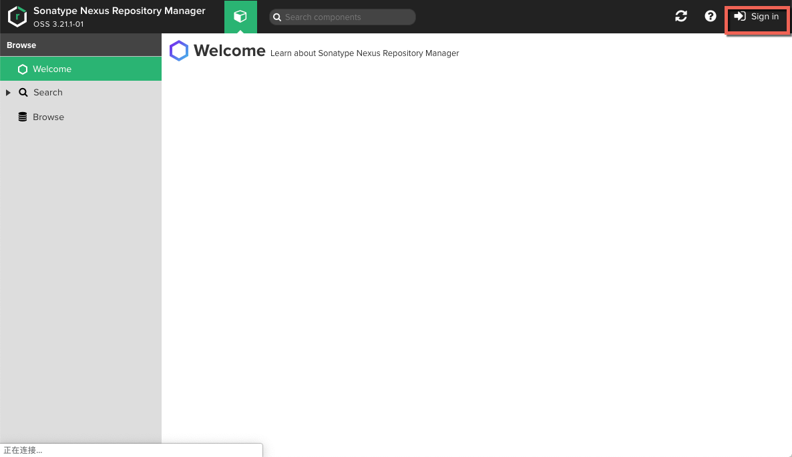
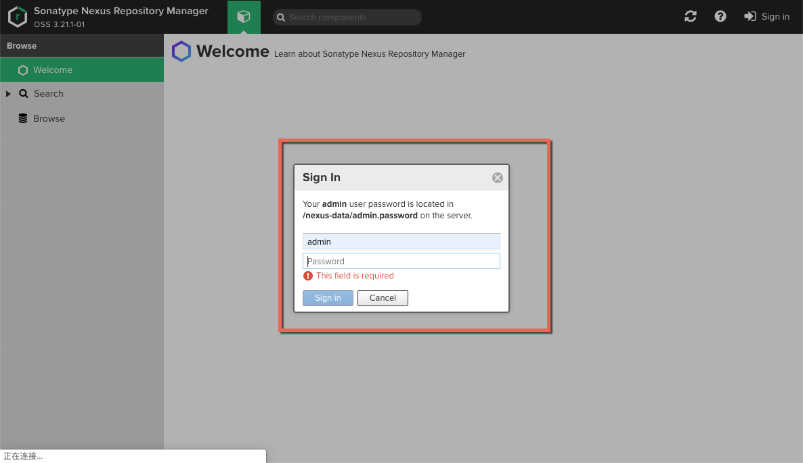
用户名默认为 admin，密码为admin.password文件中的初始密码，登陆后修改密码
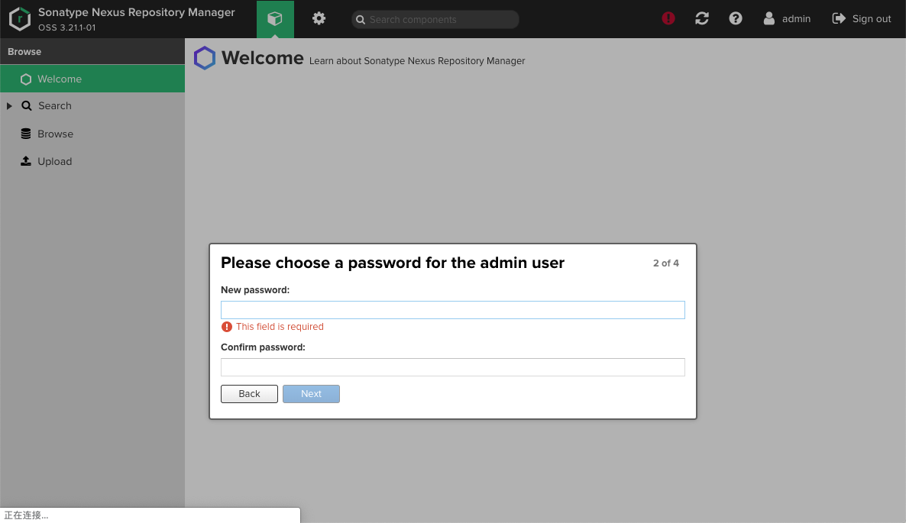
搭建完毕。