### Boat House K8S (Test & Prod) 环境部署


在前面的文档中，我们已经部署好 Jenkins 的流水线，并成功的部署了 Boat House 的 Dev 环境。
接下来，我们会使用已分配给团队的K8S环境部署 Boat House 的 Test & Prod 环境：

#### 配置 K8s 集群 & Jenkins 凭据
前提条件：安装Kubectl工具：https://kubernetes.io/docs/tasks/tools/install-kubectl/
1. 进入本地用户根目录下的 .kube 文件夹中，我们可以看到有一个名为 config 的文件，此文件即为本机 kubectl 默认链接的集群配置文件
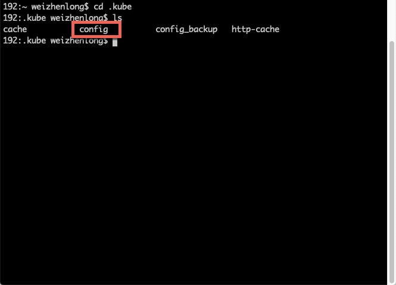

1. 我们需要使用分配给团队的K8s Config 登陆集群，即修改步骤1中 .kube 文件夹下的 Config 文件为团队的 K8s Config，打开团队 K8s Config文件我们可以看到如下内容：

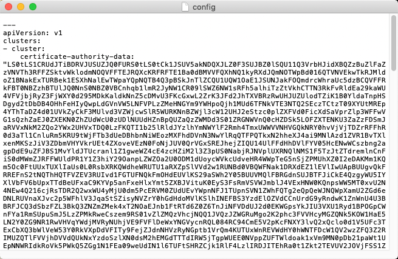

使用替换文件或修改文件内容的方式修改.kube下的config。

1. 保存完毕后运行命令，查看连接情况：
    ```
    kubectl get pods -n kube-system
    ```
    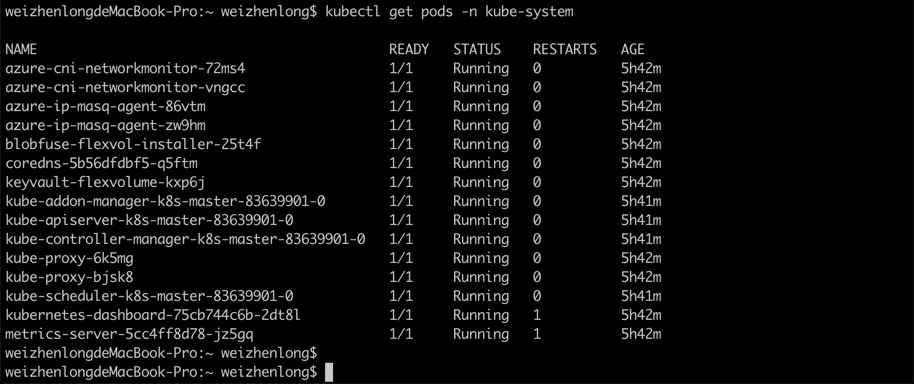
1. 创建 test & prod 命名空间

    - 用于Jenkins流水线部署的命令空间：
    ```
    kubectl create namespace boathouse-test
    kubectl create namespace boathouse-prod
    ```
    - 用于Github Action 流水线部署的命令空间：
    ```
    kubectl create namespace boathouse-test-github
    kubectl create namespace boathouse-prod-github
    ```    
    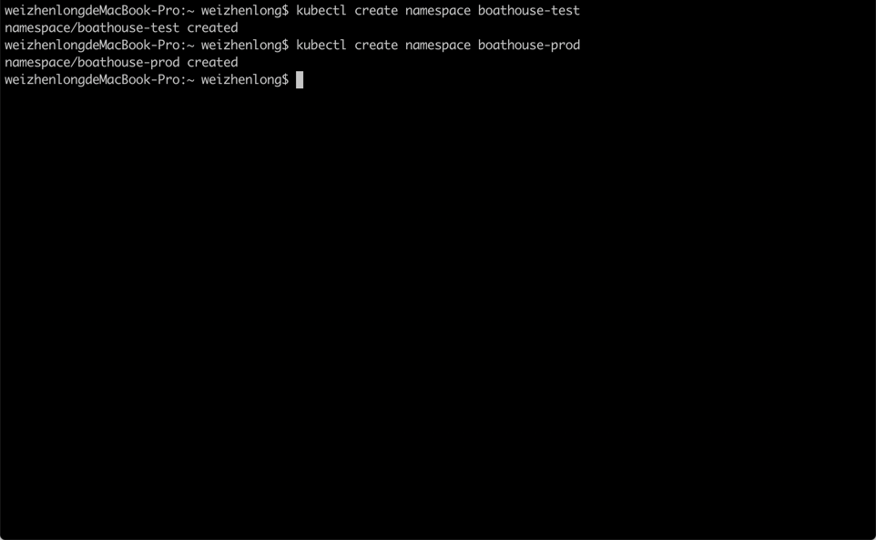
    
   
1. 为命名空间创建 docker-registry-secrets

- 用于Jenkins流水线部署
    ```
    kubectl create secret docker-registry regcred --docker-server=docker.pkg.github.com --docker-username=[username] --docker-password=[PAT] --docker-email=info@idcf.io -n boathouse-test
    kubectl create secret docker-registry regcred --docker-server=docker.pkg.github.com --docker-username=[username] --docker-password=[PAT] --docker-email=info@idcf.io -n boathouse-prod
    ```
    
 - 用于Github Action 流水线   
    ```
    kubectl create secret docker-registry regcred --docker-server=docker.pkg.github.com --docker-username=[username] --docker-password=[PAT] --docker-email=info@idcf.io -n boathouse-test
    kubectl create secret docker-registry regcred --docker-server=docker.pkg.github.com --docker-username=[username] --docker-password=[PAT] --docker-email=info@idcf.io -n boathouse-prod
    ```
    注意：此 secret 是 k8s 连接 github package 上传镜像所使用的密钥，因此 --docker-password 参数应该使用赋予了 read:package 的权限的用户的PAT。
    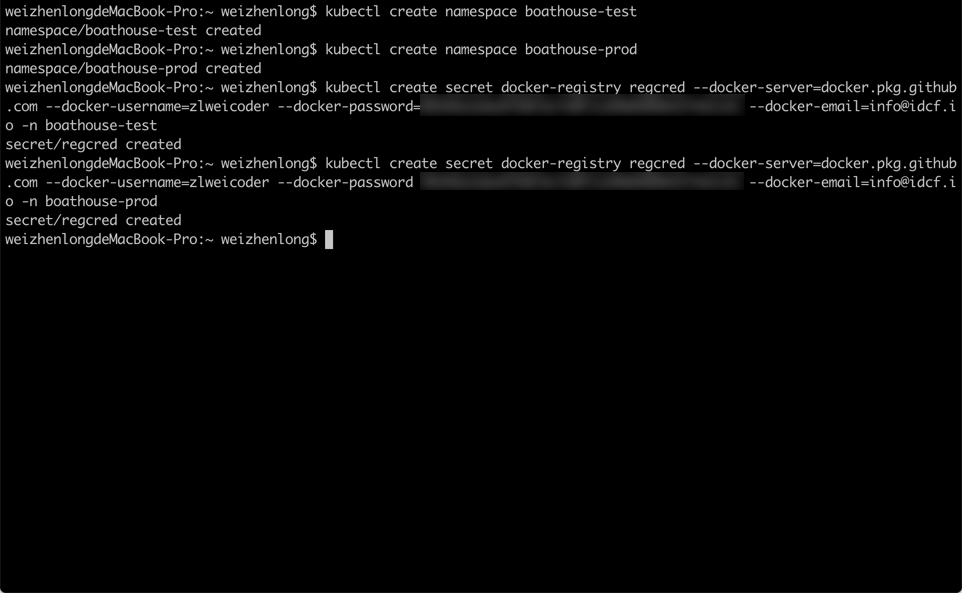
1. Jenkins 添加 Kubeconfig 凭据
    
    注意：ID 字段同我们的 K8s 部署 yaml 对应，以此默认需要写为 creds-test-k8s
1. 至此，Jenkins 和 K8s 的集群配置就完毕了。

#### 修改 test & prod K8S yaml 中的 Docker 镜像仓库地址
在之前的[团队流水线配置](https://github.com/idcf-boat-house/boat-house/wiki/团队流水线配置)文章中，我们创建了五个 Docker 镜像并推送到了团队 Github 账号的 Package 中，因此在部署 test & prod 环境时，我们需要链接到团队 Github 账号的 Docker 镜像仓库，并拉取镜像来进行部署。
1. 我们需要更新 Boat-House Repo中K8S的yaml文件，将镜像仓库的地址更新到团队环境的地址：
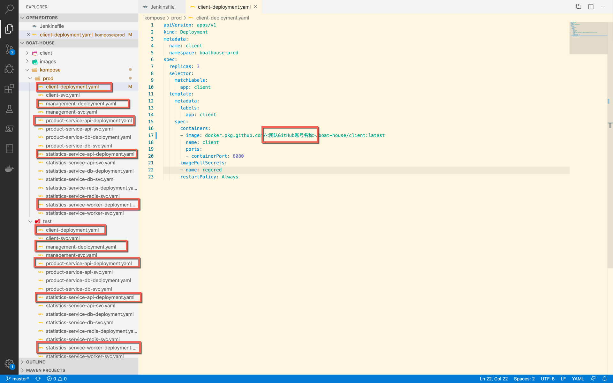
2. 修改完毕后，提交此更新到团队账号Fork的 Boat-House 代码仓库。

#### 部署测试环境
代码仓库的yaml文件提交完毕，接下来我们开始进行Jenkins流水线的部署。
1. 打开Jenkins流水线，点击分支重新启动流水线

1. Dev环境部署完毕后，点击同意部署到测试环境
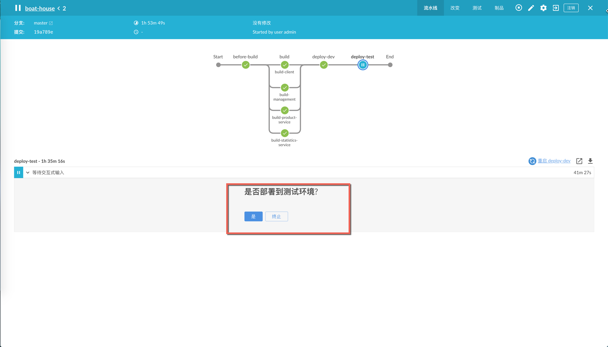
1. 等待测试环境部署完毕，可以看到该步骤执行成功

1. 回到命令行，查看测试环境命名空间下的 pods
    ```
    kubectl get pods -n boathouse-test
    ```
    可以看到测试环境已经部署成功
    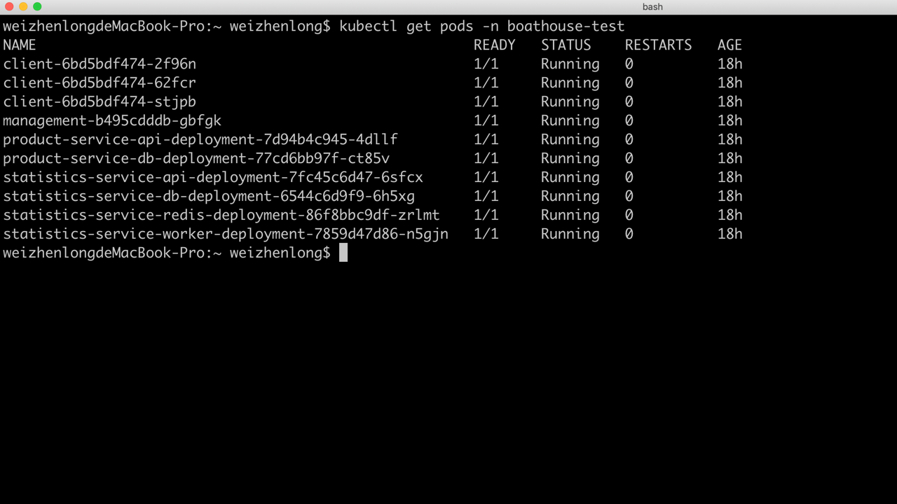
1. 运行以下命令，查看测试环境的 services 列表
    ```
    kubectl get services -n boathouse-test
    ```
    
    上图中，我们可以看到 client, management, product-service-api 服务均已经启动，外部 IP 地址和端口号也已经可以看到
1. 访问各服务的 IP地址和端口号对应的网站，可以看到环境已经成功在运行中
Client: http://[client-serivce-ip]:[port]
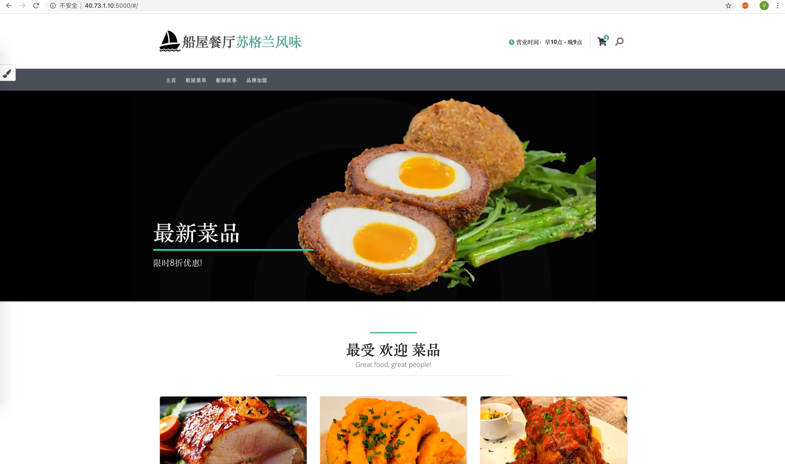
Management: http://[management-serivce-ip]:[port]

Product Service Swagger API: http://[product-serivce-api-ip]:[port]/api/v1.0/swagger-ui.html

#### 部署生产环境
1. 打开Jenkins流水线，点击同意部署到生产环境

1. 等待生产环境部署完毕，可以看到该步骤执行成功

1. 回到命令行，查看生产环境命名空间下的 pods
    ```
    kubectl get pods -n boathouse-prod
    ```
    可以看到生产环境已经部署成功
    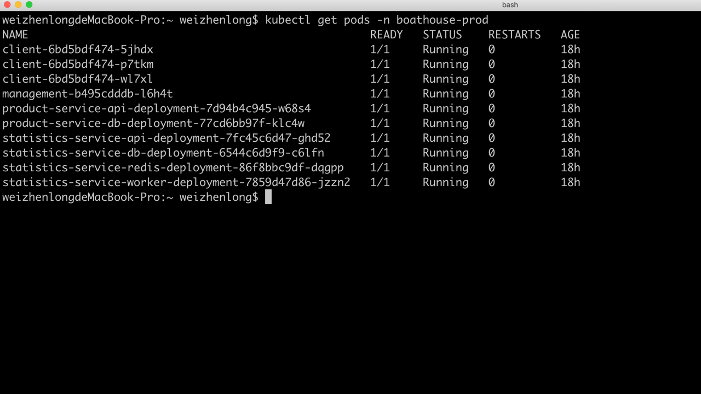
1. 查看生产环境 Services
    ```
    kubectl get services -n boathouse-prod
    ```
    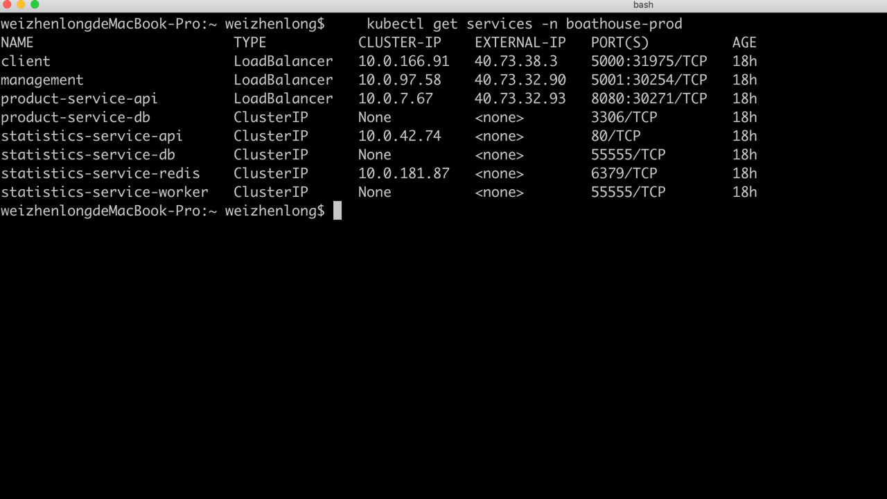
1. 访问生产环境网站


